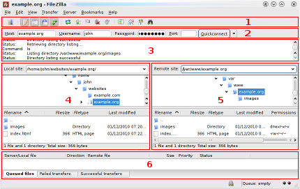

# sFTP guideline

## Introduction

Secure File Transfer Protocol (SFTP) is a file protocol for transferring large files over the web. It builds on the File Transfer Protocol (FTP) and includes Secure Shell (SSH) security components.

Secure Shell is a cryptographic component of internet security. SSH and SFTP were designed by the Internet Engineering Task Force (IETF) for greater web security. SFTP transfers files security using SSH and encrypted FTP commands to avoid password sniffing and exposing sensitive information in plain text. Since the client needs to be authenticated by the server, SFTP also protects against man-in-the-middle attacks.

SFTP can be handy in all situations where sensitive data needs to be protected. For example, a Relecov user for encrypting the upload of sequencing data and sensitive metadata.

This protocol can be launched either as a command line or through a graphical user interface (GUI). In the first type of setup, the user has to type in specific command lines to generate the SFTP protocol, usually in a Linux environment. The latter option, that we recommend, makes use of a program that abstracts the use of SFTP visually for end users.

For this purpose, we recommend (Filezilla)[https://filezilla-project.org/]. This software allows to connect to a FTP server, download and upload files and all with a friendly graphic layout.

## Connectiong to a server

Each Relecov user has its own ID and password with they might connect to Relecov sFTP server. As example:

```
 Host: sftprelecov.isciii.es
 Username: COD-MAD-2100
 Password: 12345
 Port: 50122
```

You can use the quickconnect bar for establishing the connection, like the figure 1.


Enter the hostname into the quickconnect bar's *Host*: sftprelecov.isciii.es, the username into the *Username*: COD-MAD-2100, the password into the *Password*: 12345 as well as *Port*: 50122. Now click on *Quickconnect*.

FileZilla will now try to connect to the server. If all works well, you will notice that the right "column" switched from Not connected to any server to displaying a list of files and directories.

## Navigating and window layout

In figure 2, we can note the FileZilla layout. 



We explain a quick introduction:
- Below the toolbar (1) and quick connect bar (2), the message log (3) displays transfer and connection related messages.
- Below, you can find the file listings. The left column (local pane, 4) displays the local files and directories, i.e. your local PC files. The right column (server pane, 5) displays the files and directories on the Relecov server you are connected to. Both columns have a directory tree at the top and a detailed listing of the currently selected directory's contents at the bottom. You can easily navigate either of the trees and lists by clicking around like in any other file manager. At the bottom of the window, the transfer queue (6) lists the to-be-transferred and already transferred files.

## Transferring files

Now we will upload these files (or the ones you choose, respectively):

- fastq
- metadata
- mdsum

